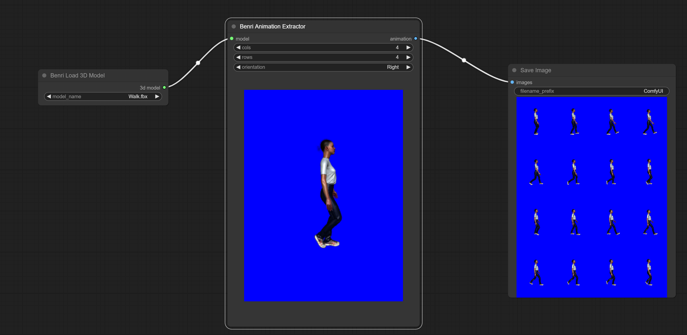
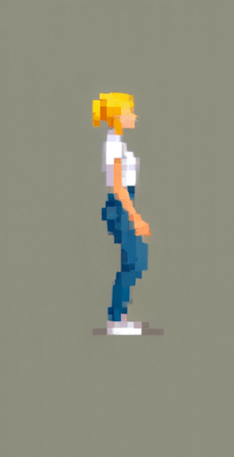
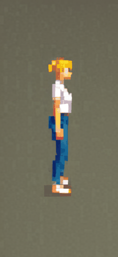

# ComfyUI Benripack Nodes

This package contains three custom nodes for ComfyUI:

1. Benri Character Pipe
2. Benri Load 3D Model
3. Benri Animation Extractor

## 1. Benri Character Pipe

This node manages character information and prompts for image generation.

### Parameters:

- **character_pipe** (optional): An existing CHARACTER_PIPE object
- **face_image** (optional): A face image (IMAGE)
- **pose_image** (optional): A pose image (IMAGE)
- **add_positive_master_prompt** (optional): Positive master prompt (CONDITIONING)
- **add_negative_master_prompt** (optional): Negative master prompt (CONDITIONING)
- **add_positive_char_prompt** (optional): Positive character prompt (CONDITIONING)
- **add_negative_char_prompt** (optional): Negative character prompt (CONDITIONING)
- **model** (optional): An AI model (MODEL)
- **clip** (optional): A CLIP model (CLIP)
- **vae** (optional): A VAE model (VAE)
- **ipadapter** (optional): An IPAdapter model (IPADAPTER)

### Functionality:

The node combines all inputs into a CharacterPipe object that can be used for further processing in the image generation pipeline.

## 2. Benri Load 3D Model

This node loads a 3D model (.fbx) from the 3d_models directory in the root of your ComfyUI installation. Before using this node create the
directory 3d_models. Than put in some .fbx files.

### Parameters:

- **model_name** (required): Name of the 3D model to load

### Functionality:

The node loads the selected 3D model.

## 3. Benri Animation Extractor

This node extracts animation frames from a 3D model. If you select 4 rows and 4 columns the node will take a snapshot every 1/16 of the
animation time. You can set the orientation of the model. You can also rotate the model. The created tile-image can be used to create consistent
animations of the given object.

### Parameters:

- **cols** (required): Number of columns in the output image (INT, default: 4)
- **rows** (required): Number of rows in the output image (INT, default: 4)
- **orientation** (optional): Orientation of the model ("Front", "Back", "Left", "Right", "Rotate")
- **model** (optional): A 3D model (MODEL_3D)

### Functionality:

The node generates an image with multiple frames of an animation based on the given 3D model and specified parameters.

## Example GIFs

Here are some example GIFs demonstrating the functionality of these nodes:

## Installation

1. Copy the node files into your ComfyUI custom_nodes directory.
2. Ensure you have a `3d_models` folder in your ComfyUI main directory.
3. Place your 3D models (.fbx) in the `3d_models` folder.

## Usage

After installation, you can use the nodes in your ComfyUI workflow. Connect the nodes according to your requirements and experiment with different settings to achieve desired results.

## Dependencies

This package relies on the following Python libraries:
- torch
- numpy
- PIL (Python Imaging Library)

Make sure these dependencies are installed in your ComfyUI environment.
